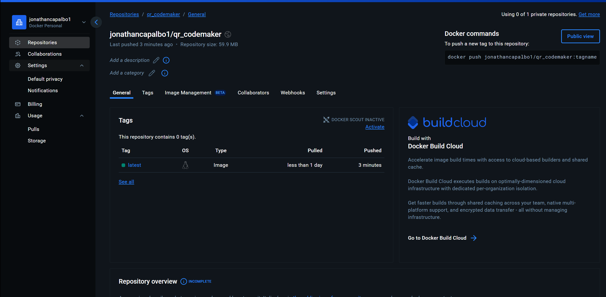
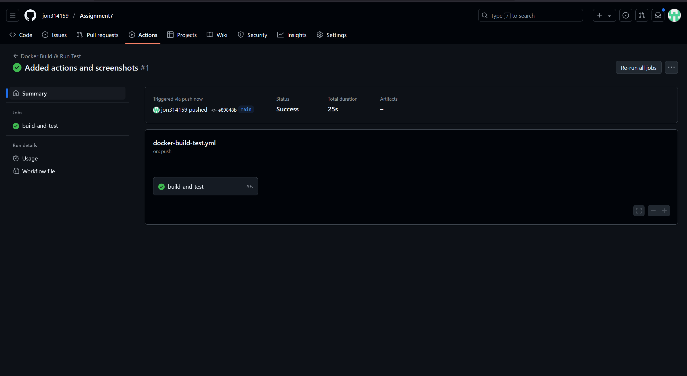

QRCODE DOCKER qr_codes/QRCode_20250630230047.png
QRCODE GITHUB qr_codes/QRCode_20250630230251.png


# 📦 Project Setup

---

# 🧩 1. Install Homebrew (Mac Only)

> Skip this step if you're on Windows.

Homebrew is a package manager for macOS.  
You’ll use it to easily install Git, Python, Docker, etc.

**Install Homebrew:**

```bash
/bin/bash -c "$(curl -fsSL https://raw.githubusercontent.com/Homebrew/install/HEAD/install.sh)"
```

**Verify Homebrew:**

```bash
brew --version
```

If you see a version number, you're good to go.

---

# 🧩 2. Install and Configure Git

## Install Git

- **MacOS (using Homebrew)**

```bash
brew install git
```

- **Windows**

Download and install [Git for Windows](https://git-scm.com/download/win).  
Accept the default options during installation.

**Verify Git:**

```bash
git --version
```

---

## Configure Git Globals

Set your name and email so Git tracks your commits properly:

```bash
git config --global user.name "Your Name"
git config --global user.email "your_email@example.com"
```

Confirm the settings:

```bash
git config --list
```

---

## Generate SSH Keys and Connect to GitHub

> Only do this once per machine.

1. Generate a new SSH key:

```bash
ssh-keygen -t ed25519 -C "your_email@example.com"
```

(Press Enter at all prompts.)

2. Start the SSH agent:

```bash
eval "$(ssh-agent -s)"
```

3. Add the SSH private key to the agent:

```bash
ssh-add ~/.ssh/id_ed25519
```

4. Copy your SSH public key:

- **Mac/Linux:**

```bash
cat ~/.ssh/id_ed25519.pub | pbcopy
```

- **Windows (Git Bash):**

```bash
cat ~/.ssh/id_ed25519.pub | clip
```

5. Add the key to your GitHub account:
   - Go to [GitHub SSH Settings](https://github.com/settings/keys)
   - Click **New SSH Key**, paste the key, save.

6. Test the connection:

```bash
ssh -T git@github.com
```

You should see a success message.

---

# 🧩 3. Clone the Repository

Now you can safely clone the course project:

```bash
git clone <repository-url>
cd <repository-directory>
```

---

# 🛠️ 4. Install Python 3.10+

## Install Python

- **MacOS (Homebrew)**

```bash
brew install python
```

- **Windows**

Download and install [Python for Windows](https://www.python.org/downloads/).  
✅ Make sure you **check the box** `Add Python to PATH` during setup.

**Verify Python:**

```bash
python3 --version
```
or
```bash
python --version
```

---

## Create and Activate a Virtual Environment

(Optional but recommended)

```bash
python3 -m venv venv
source venv/bin/activate   # Mac/Linux
venv\Scripts\activate.bat  # Windows
```

### Install Required Packages

```bash
pip install -r requirements.txt
```

---

# 🐳 5. (Optional) Docker Setup

> Skip if Docker isn't used in this module.

## Install Docker

- [Install Docker Desktop for Mac](https://www.docker.com/products/docker-desktop/)
- [Install Docker Desktop for Windows](https://www.docker.com/products/docker-desktop/)

## Build Docker Image

```bash
docker build -t <image-name> .
```

## Run Docker Container

```bash
docker run -it --rm <image-name>
```

---

# 🚀 6. Running the Project

- **Without Docker**:

```bash
python main.py
```

(or update this if the main script is different.)

- **With Docker**:

```bash
docker run -it --rm <image-name>
```

---

# 📝 7. Submission Instructions

After finishing your work:

```bash
git add .
git commit -m "Complete Module X"
git push origin main
```

Then submit the GitHub repository link as instructed.

qr_codes/QRCode_20250630230047.png
qr_codes/QRCode_20250630230251.png

---

# 🔥 Useful Commands Cheat Sheet

| Action                         | Command                                          |
| ------------------------------- | ------------------------------------------------ |
| Install Homebrew (Mac)          | `/bin/bash -c "$(curl -fsSL https://raw.githubusercontent.com/Homebrew/install/HEAD/install.sh)"` |
| Install Git                     | `brew install git` or Git for Windows installer |
| Configure Git Global Username  | `git config --global user.name "Your Name"`      |
| Configure Git Global Email     | `git config --global user.email "you@example.com"` |
| Clone Repository                | `git clone <repo-url>`                          |
| Create Virtual Environment     | `python3 -m venv venv`                           |
| Activate Virtual Environment   | `source venv/bin/activate` / `venv\Scripts\activate.bat` |
| Install Python Packages        | `pip install -r requirements.txt`               |
| Build Docker Image              | `docker build -t <image-name> .`                |
| Run Docker Container            | `docker run -it --rm <image-name>`               |
| Push Code to GitHub             | `git add . && git commit -m "message" && git push` |

---

# 📋 Notes

- Install **Homebrew** first on Mac.
- Install and configure **Git** and **SSH** before cloning.
- Use **Python 3.10+** and **virtual environments** for Python projects.
- **Docker** is optional depending on the project.

---

# 📎 Quick Links

- [Homebrew](https://brew.sh/)
- [Git Downloads](https://git-scm.com/downloads)
- [Python Downloads](https://www.python.org/downloads/)
- [Docker Desktop](https://www.docker.com/products/docker-desktop/)
- [GitHub SSH Setup Guide](https://docs.github.com/en/authentication/connecting-to-github-with-ssh)
